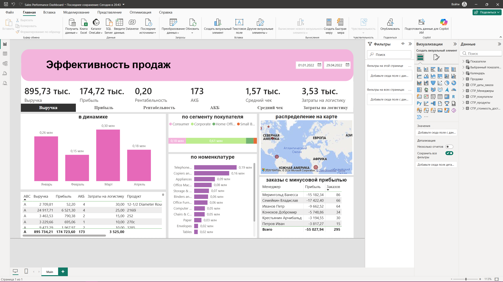

# Sales Performance Dashboard

### Предварительный просмотр

### Интерактивный дашборд для анализа продаж, разработанный в Microsoft Power BI.

Проект демонстрирует навыки построения модели данных, подготовки данных в Power Query, разработки мер на DAX и создания интерактивной аналитической отчетности.

# Возможности дашборда

- Анализ выручки
- Анализ прибыли
- Расчет рентабельности
- Анализ активной клиентской базы (АКБ)
- Расчет среднего чека
- Анализ затрат на логистику
- Динамический выбор KPI
- Анализ динамики продаж
- Анализ покупателей по сегментам
- Drill-down по иерархии товаров
- Географический анализ продаж
- ABC-анализ номенклатуры
- Таблица менеджеров с отрицательной прибылью

# Используемые технологии

- Microsoft Power BI
- Power Query
- DAX
- Модель данных «Звезда»
- Field Parameters
- Drill-down
- Интерактивные фильтры

# Структура модели данных

Проект построен по классической схеме «звезда».
### Таблица фактов
- Продажи
### Таблицы измерений
- Календарь
- Покупатели
- Продукты
- Менеджеры
- Стоимость доставки

# Основные показатели

В проекте реализованы следующие бизнес-показатели:
- Выручка
- Прибыль
- Рентабельность
- АКБ
- Средний чек
- Затраты на логистику

# Реализованные возможности Power BI

В ходе разработки были использованы:
-  Подготовка и очистка данных в Power Query.
- Построение модели данных по схеме «звезда».
- Создание календарной таблицы.
- Разработка бизнес-метрик на DAX.
- Динамический выбор KPI (Field Parameters).
- Иерархический Drill-down по номенклатуре.
- ABC-анализ товаров.
- Географическая визуализация продаж.
- Интерактивная фильтрация и кросс-фильтрация визуализаций.
